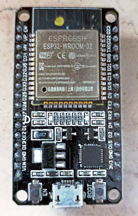

# hello, ESP

my experiments running Rust on ESP32.

This is my ESP32, found in a drawer taking dust ...

instead of dust, let's make it Rust :D 

## useful links:

https://github.com/esp-rs/rust-build

https://github.com/esp-rs/esp-idf-template

## Dev Containers ? YES!

