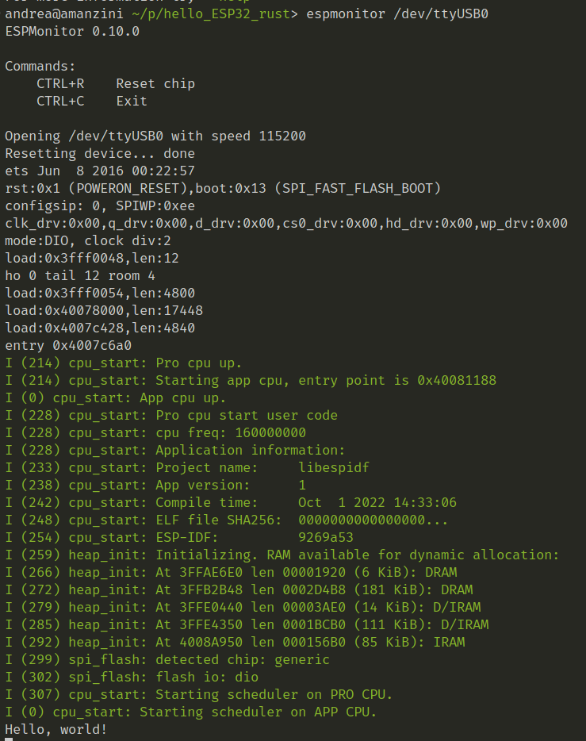

# hello, ESP

my experiments running Rust on ESP32.

This is my ESP32, found in a drawer taking dust ...

instead of dust, let's make it Rust :D 

## deps:

- udev-devel

## tools:

- cargo install cargo-generate
- cargo install ldproxy
- cargo install espflash
- cargo install espmonitor

## useful links:

https://github.com/esp-rs/rust-build

https://github.com/esp-rs/esp-idf-template

## Dev Containers ? YES!

## Result

